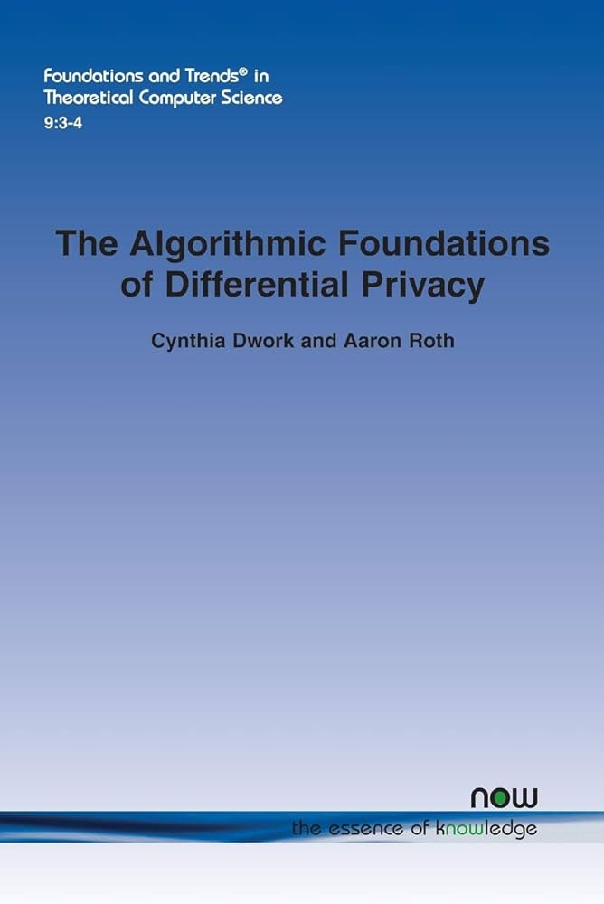

# 差分隐私算法基础

本书为差分隐私经典理论书籍[《The Algorithmic Foundations of Differential Privacy》](https://www.cis.upenn.edu/~aaroth/Papers/privacybook.pdf)的中文译本。

* **Cynthia Dwork, Aaron Roth（著）**
* **[侯建鹏](https://www.linkedin.com/in/houjp/)（译）**

  

